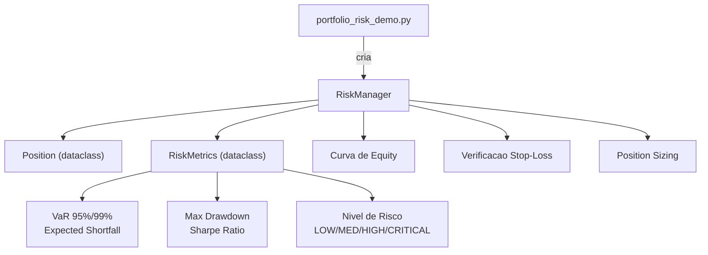
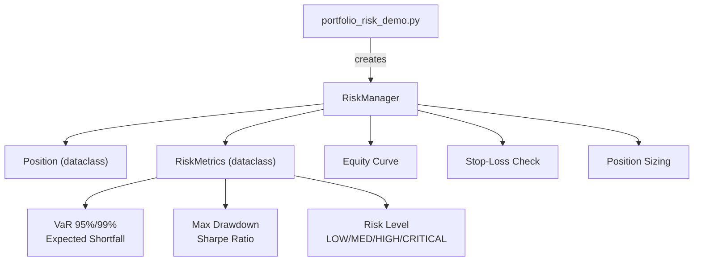

# Risk Management System

Sistema de gerenciamento de risco para portfolios de trading com calculo de VaR, position sizing e stop-loss.


[Portugues](#portugues) | [English](#english)

---

## Portugues

### Sobre

Sistema de gerenciamento de risco para portfolios de trading implementado em Python. A classe `RiskManager` oferece:

- **Position Sizing**: calcula tamanho otimo de posicao com base em capital disponivel, limite maximo de exposicao por posicao e risco por trade
- **Value at Risk (VaR)**: calculo historico e parametrico nos niveis de confianca 95% e 99%
- **Expected Shortfall (CVaR)**: perda media esperada alem do VaR
- **Max Drawdown**: calcula drawdown maximo a partir da curva de equity
- **Sharpe Ratio**: ratio de Sharpe anualizado (base 252 dias uteis)
- **Stop-Loss**: verificacao de stop-loss para posicoes long e short
- **Curva de Equity**: registra valor total do portfolio a cada atualizacao de preco
- **Nivel de Risco**: classifica portfolio em LOW, MEDIUM, HIGH ou CRITICAL com base em drawdown e VaR

### Como Usar

```bash
# Clonar o repositorio
git clone https://github.com/galafis/risk-management-system.git
cd risk-management-system

# Criar ambiente virtual
python -m venv venv
source venv/bin/activate  # Windows: venv\Scripts\activate

# Instalar dependencias
pip install -r requirements.txt

# Executar exemplo embutido
python src/risk_manager.py

# Executar demo do portfolio
python examples/portfolio_risk_demo.py

# Executar testes
pytest tests/ -v
```

### Uso Programatico

```python
from src.risk_manager import RiskManager

rm = RiskManager(
    initial_capital=100000,
    max_position_size=0.10,   # 10% max por posicao
    max_portfolio_risk=0.02,  # 2% risco por trade
    stop_loss_percent=0.05,   # 5% stop-loss
)

# Calcular tamanho de posicao
size = rm.calculate_position_size(price=150.0)

# Adicionar posicoes
rm.add_position("AAPL", quantity=100, price=150.0)

# Atualizar precos (atualiza curva de equity)
rm.update_position_price("AAPL", 155.0)

# Calcular metricas de risco
metrics = rm.calculate_portfolio_metrics()
print(f"VaR 95%: {metrics.var_95:.2f}")
print(f"Max Drawdown: {metrics.max_drawdown:.2%}")
print(f"Risk Level: {metrics.risk_level.value}")

# Fechar posicao
pnl = rm.close_position("AAPL")
```

### Arquitetura



### Estrutura do Projeto

```
risk-management-system/
├── src/
│   ├── __init__.py
│   └── risk_manager.py          # Classe RiskManager + dataclasses Position, RiskMetrics
├── examples/
│   └── portfolio_risk_demo.py   # Demo com 5 acoes e simulacao de precos
├── tests/
│   ├── __init__.py
│   └── test_main.py             # 30 testes funcionais
├── requirements.txt
├── LICENSE
└── README.md
```

### Tecnologias

- **Python 3.9+** — linguagem principal
- **NumPy 1.24+** — calculos de VaR, Sharpe, volatilidade

### Limitacoes

- Beta do portfolio e fixo em 1.0 (placeholder, nao implementado)
- Nao se conecta a corretoras ou feeds de dados reais
- Nao inclui Dockerfile ou CI/CD
- VaR parametrico usa z-scores fixos (1.645 e 2.326) sem interpolacao

---

## English

### About

Risk management system for trading portfolios implemented in Python. The `RiskManager` class provides:

- **Position Sizing**: calculates optimal position size based on available capital, maximum exposure per position, and risk per trade
- **Value at Risk (VaR)**: historical and parametric calculation at 95% and 99% confidence levels
- **Expected Shortfall (CVaR)**: average expected loss beyond VaR
- **Max Drawdown**: calculates maximum drawdown from the equity curve
- **Sharpe Ratio**: annualized Sharpe ratio (252 trading days)
- **Stop-Loss**: stop-loss check for long and short positions
- **Equity Curve**: records total portfolio value on each price update
- **Risk Level**: classifies portfolio as LOW, MEDIUM, HIGH, or CRITICAL based on drawdown and VaR

### Usage

```bash
# Clone the repository
git clone https://github.com/galafis/risk-management-system.git
cd risk-management-system

# Create virtual environment
python -m venv venv
source venv/bin/activate  # Windows: venv\Scripts\activate

# Install dependencies
pip install -r requirements.txt

# Run built-in example
python src/risk_manager.py

# Run portfolio demo
python examples/portfolio_risk_demo.py

# Run tests
pytest tests/ -v
```

### Programmatic Usage

```python
from src.risk_manager import RiskManager

rm = RiskManager(
    initial_capital=100000,
    max_position_size=0.10,   # 10% max per position
    max_portfolio_risk=0.02,  # 2% risk per trade
    stop_loss_percent=0.05,   # 5% stop-loss
)

# Calculate position size
size = rm.calculate_position_size(price=150.0)

# Add positions
rm.add_position("AAPL", quantity=100, price=150.0)

# Update prices (updates equity curve)
rm.update_position_price("AAPL", 155.0)

# Calculate risk metrics
metrics = rm.calculate_portfolio_metrics()
print(f"VaR 95%: {metrics.var_95:.2f}")
print(f"Max Drawdown: {metrics.max_drawdown:.2%}")
print(f"Risk Level: {metrics.risk_level.value}")

# Close position
pnl = rm.close_position("AAPL")
```

### Architecture



### Project Structure

```
risk-management-system/
├── src/
│   ├── __init__.py
│   └── risk_manager.py          # RiskManager class + Position, RiskMetrics dataclasses
├── examples/
│   └── portfolio_risk_demo.py   # Demo with 5 stocks and price simulation
├── tests/
│   ├── __init__.py
│   └── test_main.py             # 30 functional tests
├── requirements.txt
├── LICENSE
└── README.md
```

### Technologies

- **Python 3.9+** — core language
- **NumPy 1.24+** — VaR, Sharpe, volatility calculations

### Limitations

- Portfolio beta is fixed at 1.0 (placeholder, not implemented)
- Does not connect to brokers or real data feeds
- Does not include Dockerfile or CI/CD
- Parametric VaR uses fixed z-scores (1.645 and 2.326) without interpolation

---

## Autor / Author

**Gabriel Demetrios Lafis**
- GitHub: [@galafis](https://github.com/galafis)
- LinkedIn: [Gabriel Demetrios Lafis](https://linkedin.com/in/gabriel-demetrios-lafis)

## Licenca / License

MIT License - veja [LICENSE](LICENSE) para detalhes / see [LICENSE](LICENSE) for details.
